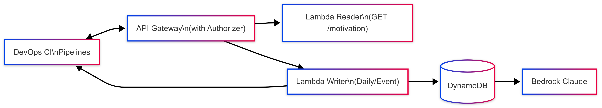

# IA Motivation Phrases Cloud API 🚀
[](https://www.terraform.io/)
[](https://aws.amazon.com/lambda/)
[](https://aws.amazon.com/api-gateway/)
[](https://aws.amazon.com/bedrock/)
[](https://aws.amazon.com/dynamodb/)

> **“Empower your pipelines, apps and teams with fresh, AI-generated motivational quotes—delivered via serverless cloud APIs!”**

---

## ✨ Overview

This project delivers an **AI-powered REST API** to generate and serve original motivational phrases for tech teams, CI/CD pipelines, dashboards, or applications.  
Designed for seamless integration, the API offers **secure, programmatic access to generative AI** via standard REST endpoints, protected with **JWT-based authentication** and token validation through a custom **Lambda Authorizer**.

The backend leverages **AWS Lambda**, **Bedrock Claude 3 Sonnet**, **API Gateway**, and **DynamoDB**, all provisioned and managed with **Terraform**.  
The architecture is fully **serverless**, **stateless**, and **cost-efficient**, ensuring no operational overhead and scalable on demand.

**Key features:**

- **Multi-layered security:** Lambda Authorizer for JWT/token validation, API throttling, WAF-ready.
- **RESTful & DevOps-friendly:** Instantly consumable from any pipeline, workflow, or application that supports HTTP calls.
- **Plug-and-play integration:** Easily connect motivational phrase generation to any frontend, backend, Slackbot, dashboard, or workflow that can call an authenticated REST API.
- **Generative AI for everyone:** Expose the power of Bedrock Claude 3 to your team, product, or automation—without writing a single ML model or worrying about infra.

---

## 🏗️ Architecture



---

```yaml

## 🧩 Features

- **GET `/motivation`** — fetch a fresh motivational quote from DynamoDB.
- **Automatic AI generation:** Daily scheduled phrases via EventBridge + Bedrock Claude 3 Sonnet.
- **On-demand AI generation:** Easily extend to trigger phrase generation any time.
- **API secured with Lambda Authorizer** — bring your own token!
- **Request rate limiting** — throttle API to 100 requests/minute.
```
---

```bash
## 🚀 Quickstart

### 1. **Clone the repo**
```bash
git clone https://github.com/cetinakarlos/ia-motivation-phrases-cloud-api.git
cd ia-motivation-phrases-cloud-api
```

# 2. Review the project structure
```text
.
├── lambdas/
│   ├── generator/         # Lambda for AI generation (Bedrock Claude)
│   └── reader/            # Lambda for reading quotes from DynamoDB
├── terraform/             # Terraform modules (optional)
├── main.tf                # Terraform root configuration
├── requirements.txt
└── README.md
```

# 3. Deploy Infrastructure

Ensure your AWS CLI is configured and Bedrock is enabled on your account.

```bash
terraform init
terraform apply
```
Note: Upload zipped Lambda code as needed per Terraform config.

# 4. Invoke the API

```bash
curl -H "Authorization: magic-token-rcn" https://<api-gateway-id>.execute-api.<region>.amazonaws.com/prod/motivation
```

## ⚙️ Technologies Used

- AWS Lambda: Serverless functions (Python 3.12)
- AWS Bedrock (Claude 3 Sonnet): Generative AI for original quotes
- API Gateway: RESTful endpoint, throttling, custom Lambda Authorizer
- DynamoDB: Fast, scalable NoSQL storage
- EventBridge: Daily event trigger for phrase generation
- Terraform: Infrastructure as Code

## 🔒 Security

- API secured via Lambda Authorizer — token must be passed in Authorization header
- Rate limiting: 100 requests/minute
- Ready for WAF: Add AWS Web Application Firewall for extra protection

## 🛠️ Customization

- Change the prompt in lambda_generator.py to adapt to your team's needs
- Adjust API Gateway throttling limits in Terraform as needed
- Integrate with Slack, email, dashboards or CI tools for automatic daily inspiration

## 📦 Example Prompt for Claude 3 Sonnet

```python
prompt = (
    "You are an expert in leadership, team development, and motivational coaching. "
    "Write a brief, powerful, and unique phrase that inspires a technology development team to start their day with motivation."
)
```

## 🧠 Sample Response

```json
{
  "quote": "Great ideas are born from teamwork and positive energy. Let's make today outstanding!",
  "author": "kode-soul devops|cloud-arch Bedrock AI",
  "date": "2025-06-09T19:18:19.292844"
}
```

### 🧑‍💻 Authors
Carlos Cetina (Kode-Soul)
Inspirated in Twinme Seline Soul ideas — we were AI Architect & Documentation Powerhouse
2025